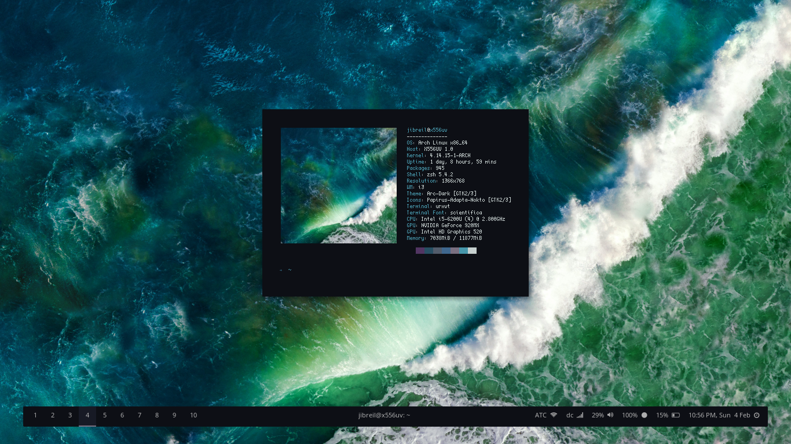
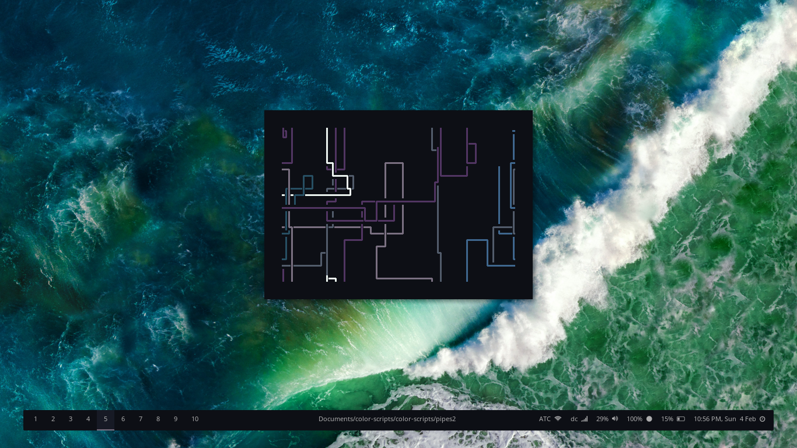
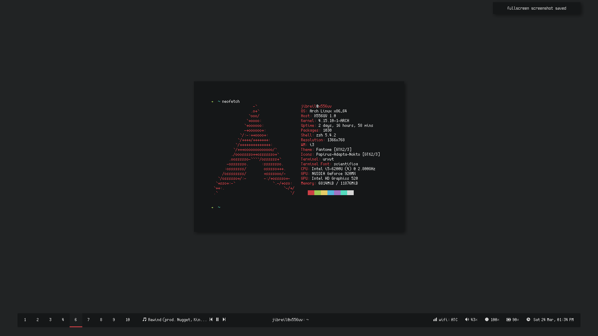
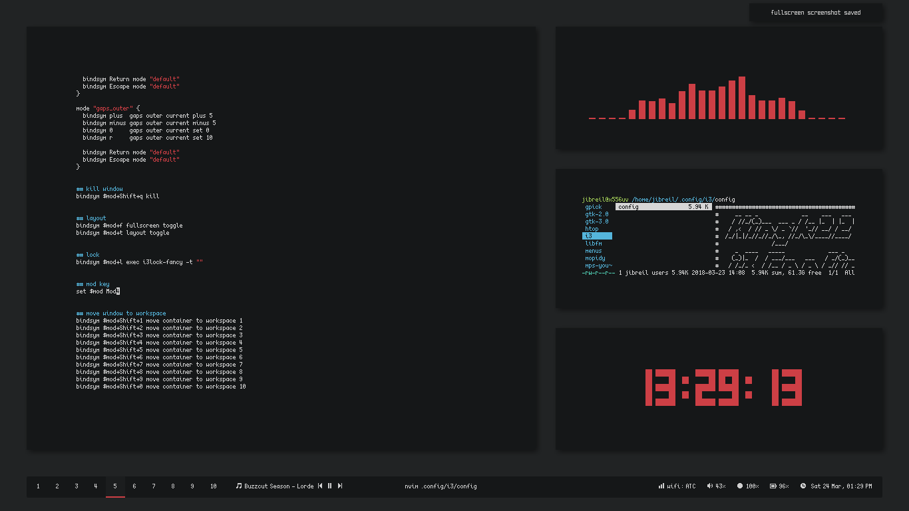
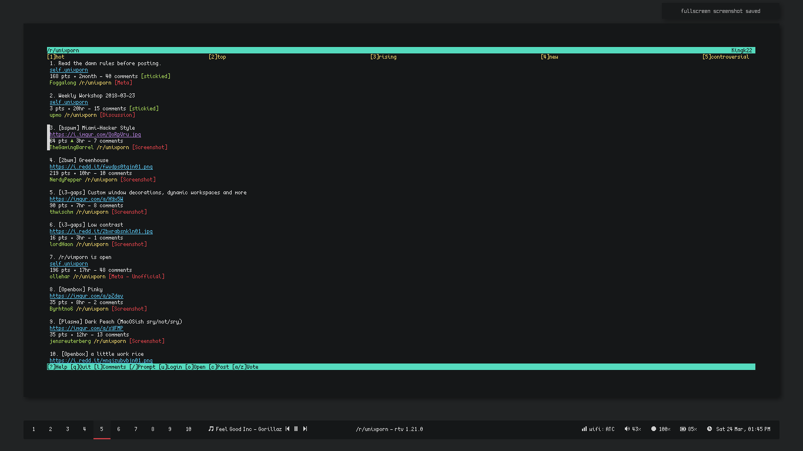

```
    __ __    _                      __     ___    ___   _         
   / //_/   (_)   ____    ____ _   / /__  |__ \  |__ \ ( )   _____
  / ,<     / /   / __ \  / __ `/  / //_/  __/ /  __/ / |/   / ___/
 / /| |   / /   / / / / / /_/ /  / ,<    / __/  / __/      (__  )
/_/ |_|  /_/   /_/ /_/  \__, /  /_/|_|  /____/ /____/     /____/  
                       /____/                                     

        __          __     ____    _     __              
   ____/ /  ____   / /_   / __/   (_)   / /  ___    _____
  / __  /  / __ \ / __/  / /_    / /   / /  / _ \  / ___/
 / /_/ /  / /_/ // /_   / __/   / /   / /  /  __/ (__  )
 \__,_/   \____/ \__/  /_/     /_/   /_/   \___/ /____/  

```

# Setup

* **bar:** [polybar](https://github.com/jaagr/polybar)
* **colour scheme:** [base16-seti](https://github.com/chriskempson/base16-xresources/blob/master/xresources/base16-seti-256.Xresources)
* **font:** [scientifica](https://github.com/NerdyPepper/scientifica) (text) + [siji](https://github.com/stark/siji) (icons)
* **launcher:** [rofi](https://github.com/DaveDavenport/rofi)
* **locker:** [i3lock-fancy](https://github.com/meskarune/i3lock-fancy)
* **music:** [mopidy](https://www.mopidy.com/) + ncmpcpp
* **os:** arch
* **screenshot tool:** [nougat](https://github.com/Sweets/nougat)
* **shell:** zsh [(oh-my-zsh](https://github.com/robbyrussell/oh-my-zsh))
* **terminal:** urxvt
* **text editor:** neovim
* **wm:** [i3-gaps](https://github.com/Airblader/i3)

# Screenshots


fun: colourblocks, bonsai, ghosts, nerdy, pipes, invaders, panes (all in `/bin`)


clean: polybar, wallpaper is `/wp/dark.png` - solid colour `#212324`


neofetch


busy: neovim, cava, ranger, tty-clock


rtv


google chrome with [this startpage](https://chrome.google.com/webstore/detail/bwnt-new-tab/doiinciigjmmlnbehjjjkeoamihggkba) and same background as the wallpaper
